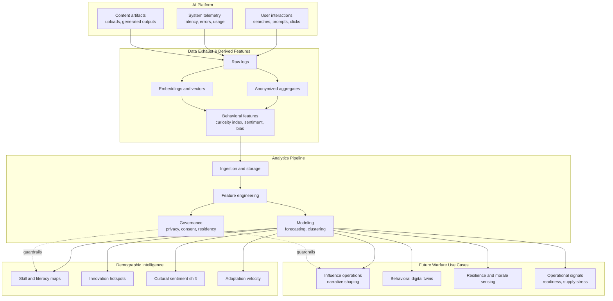

```mermaid
flowchart TB
  %% AI Platform Data → Demographics & Future Warfare

  subgraph A["AI Platform"]
    A1["User interactions<br/>searches, prompts, clicks"]
    A2["System telemetry<br/>latency, errors, usage"]
    A3["Content artifacts<br/>uploads, generated outputs"]
  end

  subgraph B["Data Exhaust & Derived Features"]
    B1["Raw logs"]
    B2["Anonymized aggregates"]
    B3["Embeddings and vectors"]
    B4["Behavioral features<br/>curiosity index, sentiment, bias"]
  end

  subgraph C["Analytics Pipeline"]
    C1["Ingestion and storage"]
    C2["Feature engineering"]
    C3["Modeling<br/>forecasting, clustering"]
    C4["Governance<br/>privacy, consent, residency"]
  end

  subgraph D["Demographic Intelligence"]
    D1["Skill and literacy maps"]
    D2["Innovation hotspots"]
    D3["Cultural sentiment shift"]
    D4["Adaptation velocity"]
  end

  subgraph E["Future Warfare Use Cases"]
    E1["Influence operations<br/>narrative shaping"]
    E2["Behavioral digital twins"]
    E3["Resilience and morale sensing"]
    E4["Operational signals<br/>readiness, supply stress"]
  end

  %% Flows
  A1 --> B1
  A2 --> B1
  A3 --> B1
  B1 --> B2
  B1 --> B3
  B2 --> B4
  B3 --> B4

  B4 --> C1
  C1 --> C2
  C2 --> C3
  C3 --> D1
  C3 --> D2
  C3 --> D3
  C3 --> D4
  C3 --> E1
  C3 --> E2
  C3 --> E3
  C3 --> E4

  %% Guardrails influence
  C2 --> C4
  C4 -. guardrails .-> D1
  C4 -. guardrails .-> E1

```
