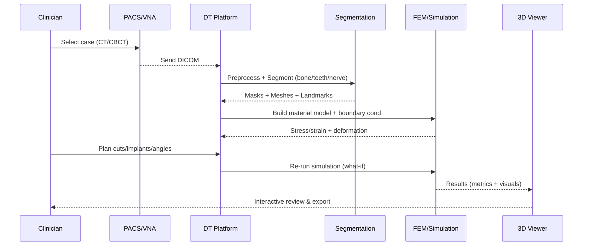

```mermaid
flowchart LR
    A[Imaging Sources\nCT / CBCT / MRI / Intraoral Scan] --> B[DICOM Import & QC]
    B --> C[Preprocessing\nResample / Denoise / Align]
    C --> D[Segmentation\nMaxilla / Mandible / Teeth / Nerves / Soft Tissue]
    D --> E[3D Reconstruction\nMeshes + Landmarks]
    E --> F[Registration & Occlusion\nUpper-Lower Alignment]
    F --> G[Biomechanics / FEM\nBone & Soft-Tissue Models]
    G --> H[Surgical / Implant Planning\nCuts, Plates, Angles]
    H --> I[Outcome Simulation\nFunction + Aesthetics]
    I --> J[Visualization\nWeb Viewer / AR / VR]
    J --> K[Export\nReports, STL, Guides, EHR]
    K --> L[Feedback Loop\nPost-op Data → Model Update]
```

```mermaid
sequenceDiagram
    participant Clinician
    participant PACS as PACS/VNA
    participant DT as DT Platform
    participant Seg as Segmentation
    participant FEM as FEM/Simulation
    participant Viz as 3D Viewer

    Clinician->>PACS: Select case (CT/CBCT)
    PACS-->>DT: Send DICOM
    DT->>Seg: Preprocess + Segment (bone/teeth/nerve)
    Seg-->>DT: Masks + Meshes + Landmarks
    DT->>FEM: Build material model + boundary cond.
    FEM-->>DT: Stress/strain + deformation
    Clinician->>DT: Plan cuts/implants/angles
    DT->>FEM: Re-run simulation (what-if)
    FEM-->>Viz: Results (metrics + visuals)
    Viz-->>Clinician: Interactive review & export

```

```mermaid
sequenceDiagram
    participant Clinician
    participant PACS as PACS/VNA
    participant DT as DT Platform
    participant Seg as Segmentation
    participant FEM as FEM/Simulation
    participant Viz as 3D Viewer

    Clinician->>PACS: Select case (CT/CBCT)
    PACS-->>DT: Send DICOM
    DT->>Seg: Preprocess + Segment (bone/teeth/nerve)
    Seg-->>DT: Masks + Meshes + Landmarks
    DT->>FEM: Build material model + boundary cond.
    FEM-->>DT: Stress/strain + deformation
    Clinician->>DT: Plan cuts/implants/angles
    DT->>FEM: Re-run simulation (what-if)
    FEM-->>Viz: Results (metrics + visuals)
    Viz-->>Clinician: Interactive review & export

```
