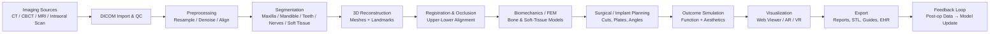

```mermaid
flowchart LR
    A[Imaging Sources\nCT / CBCT / MRI / Intraoral Scan] --> B[DICOM Import & QC]
    B --> C[Preprocessing\nResample / Denoise / Align]
    C --> D[Segmentation\nMaxilla / Mandible / Teeth / Nerves / Soft Tissue]
    D --> E[3D Reconstruction\nMeshes + Landmarks]
    E --> F[Registration & Occlusion\nUpper-Lower Alignment]
    F --> G[Biomechanics / FEM\nBone & Soft-Tissue Models]
    G --> H[Surgical / Implant Planning\nCuts, Plates, Angles]
    H --> I[Outcome Simulation\nFunction + Aesthetics]
    I --> J[Visualization\nWeb Viewer / AR / VR]
    J --> K[Export\nReports, STL, Guides, EHR]
    K --> L[Feedback Loop\nPost-op Data → Model Update]
```
