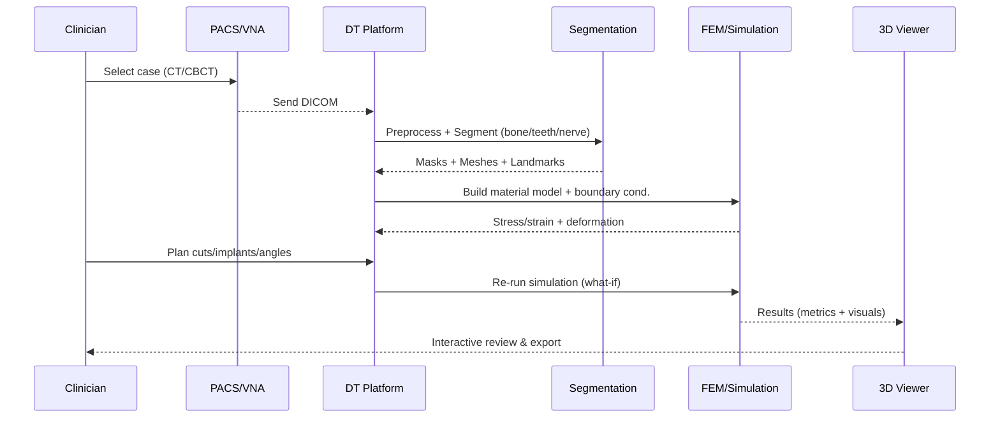
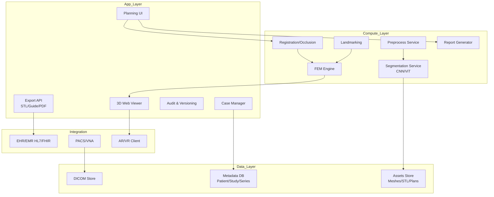

```mermaid
flowchart LR
    A[Imaging Sources\nCT / CBCT / MRI / Intraoral Scan] --> B[DICOM Import & QC]
    B --> C[Preprocessing\nResample / Denoise / Align]
    C --> D[Segmentation\nMaxilla / Mandible / Teeth / Nerves / Soft Tissue]
    D --> E[3D Reconstruction\nMeshes + Landmarks]
    E --> F[Registration & Occlusion\nUpper-Lower Alignment]
    F --> G[Biomechanics / FEM\nBone & Soft-Tissue Models]
    G --> H[Surgical / Implant Planning\nCuts, Plates, Angles]
    H --> I[Outcome Simulation\nFunction + Aesthetics]
    I --> J[Visualization\nWeb Viewer / AR / VR]
    J --> K[Export\nReports, STL, Guides, EHR]
    K --> L[Feedback Loop\nPost-op Data → Model Update]
```

```mermaid
sequenceDiagram
    participant Clinician
    participant PACS as PACS/VNA
    participant DT as DT Platform
    participant Seg as Segmentation
    participant FEM as FEM/Simulation
    participant Viz as 3D Viewer

    Clinician->>PACS: Select case (CT/CBCT)
    PACS-->>DT: Send DICOM
    DT->>Seg: Preprocess + Segment (bone/teeth/nerve)
    Seg-->>DT: Masks + Meshes + Landmarks
    DT->>FEM: Build material model + boundary cond.
    FEM-->>DT: Stress/strain + deformation
    Clinician->>DT: Plan cuts/implants/angles
    DT->>FEM: Re-run simulation (what-if)
    FEM-->>Viz: Results (metrics + visuals)
    Viz-->>Clinician: Interactive review & export

```

```mermaid
graph TD
    subgraph Data_Layer
        D1[DICOM Store]
        D2[Metadata DB\nPatient/Study/Series]
        D3[Assets Store\nMeshes/STL/Plans]
    end

    subgraph Compute_Layer
        C1[Preprocess Service]
        C2[Segmentation Service\nCNN/ViT]
        C3[Landmarking]
        C4[FEM Engine]
        C5[Registration/Occlusion]
        C6[Report Generator]
    end

    subgraph App_Layer
        A1[Case Manager]
        A2[3D Web Viewer]
        A3[Planning UI]
        A4[Audit & Versioning]
        A5[Export API\nSTL/Guide/PDF]
    end

    subgraph Integration
        I1[EHR/EMR HL7/FHIR]
        I2[PACS/VNA]
        I3[AR/VR Client]
    end

    I2 --> D1
    A1 --> D2
    A3 --> C5
    C5 --> C4
    C2 --> D3
    C1 --> C2
    C3 --> C4
    C4 --> A2
    A3 --> C6
    A5 --> I1
    A2 --> I3


```
