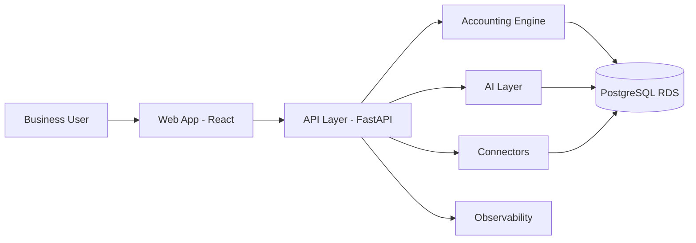
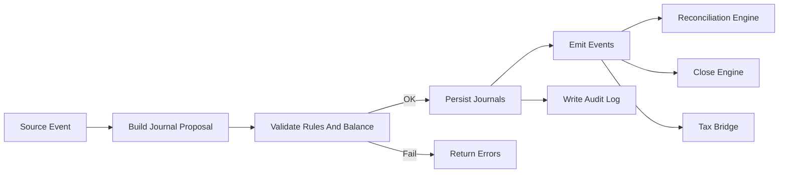
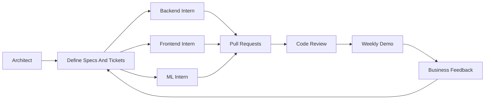
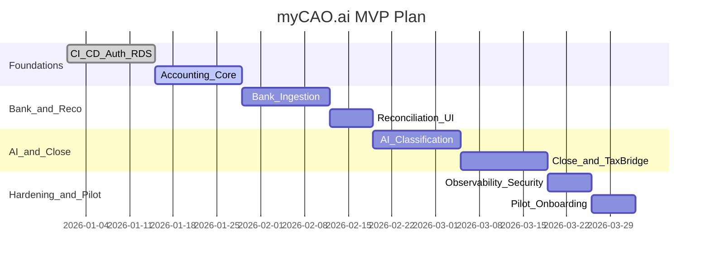
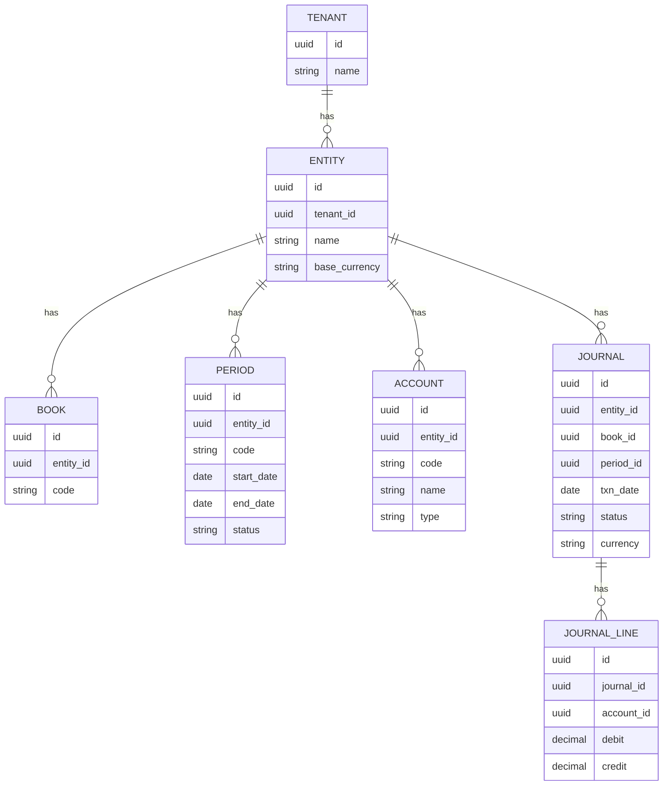

1️⃣ High-level architecture

```mermaid
flowchart LR
  U[Business User]
  UI[Web App - React]
  API[API Layer - FastAPI]
  ACCT[Accounting Engine]
  AI[AI Layer]
  INTEG[Connectors]
  DB[(PostgreSQL RDS)]
  OBS[Observability]

  U --> UI
  UI --> API
  API --> ACCT
  API --> AI
  API --> INTEG
  ACCT --> DB
  AI --> DB
  INTEG --> DB
  API --> OBS


```
2️⃣ Accounting engine posting pipeline

```mermaid
flowchart LR
  SRC[Source Event]
  BUILD[Build Journal Proposal]
  VALIDATE[Validate Rules And Balance]
  POST[Persist Journals]
  ERROR[Return Errors]
  EVENTS[Emit Events]
  AUDIT[Write Audit Log]
  RECO[Reconciliation Engine]
  CLOSE[Close Engine]
  TAX[Tax Bridge]

  SRC --> BUILD
  BUILD --> VALIDATE
  VALIDATE -->|OK| POST
  VALIDATE -->|Fail| ERROR
  POST --> EVENTS
  POST --> AUDIT
  EVENTS --> RECO
  EVENTS --> CLOSE
  EVENTS --> TAX

```
3️⃣ Team momentum loop (architect + intern pod)

```mermaid
flowchart LR
  ARCH[Architect]
  SPEC[Define Specs And Tickets]
  INT_BACK[Backend Intern]
  INT_FRONT[Frontend Intern]
  INT_ML[ML Intern]
  PR[Pull Requests]
  REVIEW[Code Review]
  DEMO[Weekly Demo]
  FEEDBACK[Business Feedback]

  ARCH --> SPEC
  SPEC --> INT_BACK
  SPEC --> INT_FRONT
  SPEC --> INT_ML
  INT_BACK --> PR
  INT_FRONT --> PR
  INT_ML --> PR
  PR --> REVIEW
  REVIEW --> DEMO
  DEMO --> FEEDBACK
  FEEDBACK --> SPEC
```

```mermaid
gantt
    dateFormat  YYYY-MM-DD
    title  myCAO.ai MVP Plan

    section Foundations
    CI_CD_Auth_RDS        :done,   t1, 2026-01-01, 14d
    Accounting_Core       :active, t2, 2026-01-15, 14d

    section Bank_and_Reco
    Bank_Ingestion        :t3, 2026-01-29, 14d
    Reconciliation_UI     :t4, 2026-02-12, 7d

    section AI_and_Close
    AI_Classification     :t5, 2026-02-19, 14d
    Close_and_TaxBridge   :t6, 2026-03-05, 14d

    section Hardening_and_Pilot
    Observability_Security :t7, 2026-03-19, 7d
    Pilot_Onboarding       :t8, 2026-03-26, 7d

```

5️⃣ Core data model (ERD for accounting engine)

```mermaid
erDiagram
  TENANT ||--o{ ENTITY : has
  ENTITY ||--o{ BOOK : has
  ENTITY ||--o{ PERIOD : has
  ENTITY ||--o{ ACCOUNT : has
  ENTITY ||--o{ JOURNAL : has
  JOURNAL ||--o{ JOURNAL_LINE : has

  TENANT {
    uuid id
    string name
  }

  ENTITY {
    uuid id
    uuid tenant_id
    string name
    string base_currency
  }

  BOOK {
    uuid id
    uuid entity_id
    string code
  }

  PERIOD {
    uuid id
    uuid entity_id
    string code
    date start_date
    date end_date
    string status
  }

  ACCOUNT {
    uuid id
    uuid entity_id
    string code
    string name
    string type
  }

  JOURNAL {
    uuid id
    uuid entity_id
    uuid book_id
    uuid period_id
    date txn_date
    string status
    string currency
  }

  JOURNAL_LINE {
    uuid id
    uuid journal_id
    uuid account_id
    decimal debit
    decimal credit
  }

```
