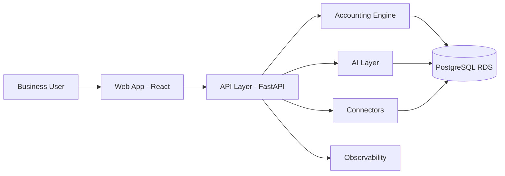
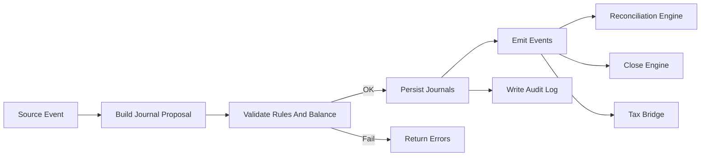

1️⃣ High-level architecture

```mermaid
flowchart LR
  U[Business User]
  UI[Web App - React]
  API[API Layer - FastAPI]
  ACCT[Accounting Engine]
  AI[AI Layer]
  INTEG[Connectors]
  DB[(PostgreSQL RDS)]
  OBS[Observability]

  U --> UI
  UI --> API
  API --> ACCT
  API --> AI
  API --> INTEG
  ACCT --> DB
  AI --> DB
  INTEG --> DB
  API --> OBS


```

```mermaid
flowchart LR
  SRC[Source Event]
  BUILD[Build Journal Proposal]
  VALIDATE[Validate Rules And Balance]
  POST[Persist Journals]
  ERROR[Return Errors]
  EVENTS[Emit Events]
  AUDIT[Write Audit Log]
  RECO[Reconciliation Engine]
  CLOSE[Close Engine]
  TAX[Tax Bridge]

  SRC --> BUILD
  BUILD --> VALIDATE
  VALIDATE -->|OK| POST
  VALIDATE -->|Fail| ERROR
  POST --> EVENTS
  POST --> AUDIT
  EVENTS --> RECO
  EVENTS --> CLOSE
  EVENTS --> TAX

```
