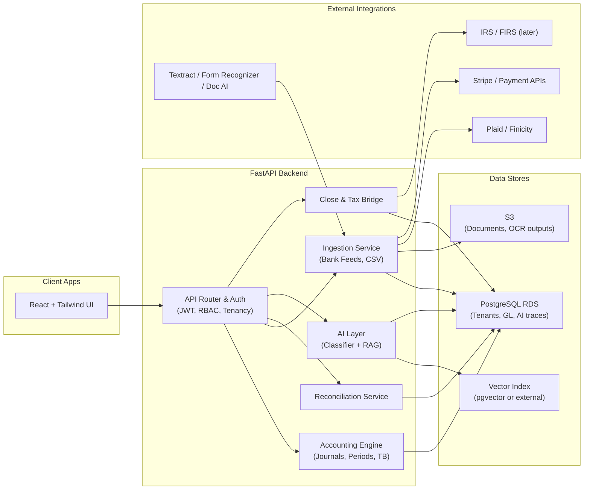

```mermaid
flowchart LR
    subgraph Client["Client Apps"]
        FE["React + Tailwind UI"]
    end

    subgraph API["FastAPI Backend"]
        ROUTER["API Router & Auth\n(JWT, RBAC, Tenancy)"]
        AE["Accounting Engine\n(Journals, Periods, TB)"]
        ING["Ingestion Service\n(Bank Feeds, CSV)"]
        RECO["Reconciliation Service"]
        AI["AI Layer\n(Classifier + RAG)"]
        CLOSE["Close & Tax Bridge"]
    end

    subgraph Data["Data Stores"]
        PG["PostgreSQL RDS\n(Tenants, GL, AI traces)"]
        S3["S3\n(Documents, OCR outputs)"]
        VEC["Vector Index\n(pgvector or external)"]
    end

    subgraph Integrations["External Integrations"]
        PLAID["Plaid / Finicity"]
        PAY["Stripe / Payment APIs"]
        OCR["Textract / Form Recognizer / Doc AI"]
        IRS["IRS / FIRS (later)"]
    end

    FE --> ROUTER
    ROUTER --> AE
    ROUTER --> ING
    ROUTER --> RECO
    ROUTER --> AI
    ROUTER --> CLOSE

    AE --> PG
    ING --> PG
    RECO --> PG
    CLOSE --> PG

    AI --> VEC
    AI --> PG
    ING --> S3
    OCR --> ING

    ING --> PLAID
    ING --> PAY
    CLOSE --> IRS


```
